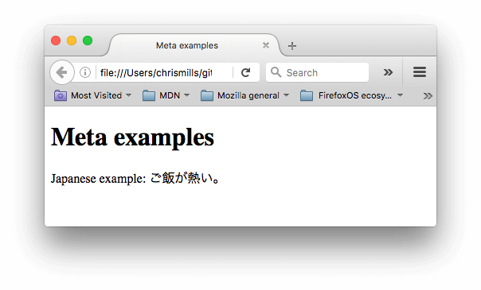
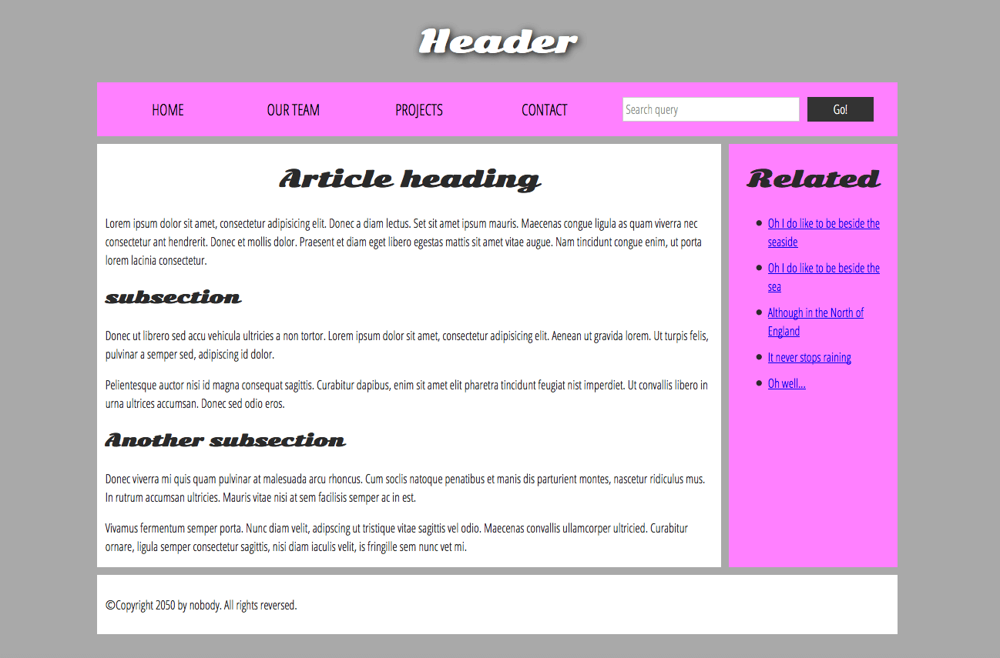

# HTML (HyperText Markup Language)

## Table of contents
- [HTML (HyperText Markup Language)](#html-hypertext-markup-language)
  - [Table of contents](#table-of-contents)
  - [HTML Foundations](#html-foundations)
    - [What is the HTML?](#what-is-the-html)
    - [Anatomy of an HTML element](#anatomy-of-an-html-element)
    - [Nesting elements](#nesting-elements)
    - [Void elements](#void-elements)
    - [Attributes](#attributes)
    - [Boolean attributes](#boolean-attributes)
    - [Whitespace in HTML](#whitespace-in-html)
    - [Characters references: including special characters in HTML](#characters-references-including-special-characters-in-html)
    - [HTML comments](#html-comments)
    - [References](#references)
  - [What's the head? Webpage metadata](#whats-the-head-webpage-metadata)
    - [What is the HTML head?](#what-is-the-html-head)
    - [Adding the title](#adding-the-title)
    - [Metadata: The \<meta\> element](#metadata-the-meta-element)
    - [Adding custom icons to your site](#adding-custom-icons-to-your-site)
    - [Applying CSS and JS to HTML](#applying-css-and-js-to-html)
    - [Setting the primary language of the document](#setting-the-primary-language-of-the-document)
    - [Refernces](#refernces)
  - [Headings and Paragraphs in HTML](#headings-and-paragraphs-in-html)
    - [Headings and Paragraphs](#headings-and-paragraphs)
    - [References](#references-1)
  - [Emphasis and Improtance](#emphasis-and-improtance)
    - [What are emphasis and important?](#what-are-emphasis-and-important)
    - [Emphasis](#emphasis)
    - [Strong importance](#strong-importance)
    - [Italic, Bold, Underline](#italic-bold-underline)
    - [References](#references-2)
  - [Lists](#lists)
    - [Unordered Lists](#unordered-lists)
    - [Ordered Lists](#ordered-lists)
    - [Nesting Lists](#nesting-lists)
    - [Description Lists](#description-lists)
      - [Description list example](#description-list-example)
    - [References](#references-3)
  - [Structuring documents](#structuring-documents)
    - [Basic section of a document](#basic-section-of-a-document)
    - [HTML For Structuring Content](#html-for-structuring-content)
    - [HTML layout elements in more detail](#html-layout-elements-in-more-detail)
      - [Non-semantic wrappers](#non-semantic-wrappers)
      - [Line Breaks and horizontal rules.](#line-breaks-and-horizontal-rules)
    - [References](#references-4)
  - [Advanced text features](#advanced-text-features)
    - [Quotations](#quotations)
      - [Blockquotes](#blockquotes)
      - [Inline quotations](#inline-quotations)
      - [Citations](#citations)
    - [Abbreviations](#abbreviations)
    - [Marking up contact details](#marking-up-contact-details)
    - [Superscript and Subscript](#superscript-and-subscript)
    - [Representing computer code](#representing-computer-code)
    - [Marking up times and dates](#marking-up-times-and-dates)
    - [References](#references-5)
  - [Creating Links](#creating-links)
    - [What is hyperlink?](#what-is-hyperlink)
    - [Anatomy of a link](#anatomy-of-a-link)
      - [Block level links](#block-level-links)
      - [Image links](#image-links)
      - [Adding supporting information with the title attribute](#adding-supporting-information-with-the-title-attribute)
    - [A quick primer on URLs and paths](#a-quick-primer-on-urls-and-paths)
    - [Email link](#email-link)
    - [References](#references-6)
  - [HTML Images](#html-images)
    - [References](#references-7)
  - [HTML audio and video](#html-audio-and-video)
    - [References](#references-8)
  - [HTML Tables](#html-tables)
    - [References](#references-9)
  - [Form and Button in HTML](#form-and-button-in-html)
    - [References](#references-10)
  - [Creating fist HTML document](#creating-fist-html-document)
    - [Images](#images)
    - [Marking up text](#marking-up-text)
      - [Headings](#headings)
      - [Paragraphs](#paragraphs)
      - [Lists](#lists-1)
      - [Links](#links)


## HTML Foundations 

### What is the HTML?
- **HTML** (HyperText Markup Language) is a markup language that tells web browsers how to structure the web pages you visit. 
- HTML consists of a series of elements, which you use to enclose, wrap, or mark up different parts of content to make it appear or act in a certain way. 
- HTML lives inside text file called **HTML Documents**, or just **documents**, with a **.html** file extension.

### Anatomy of an HTML element 
Let's further explore our paragraph element from the previous section:
```html
    <p> This is a content of web </p>
```
The anatomu of our element is:
- \<p> \- The opening tag : This consists of the name of the element (in this example, p for paragraph)
- "This is a content of web" \- The content : This is the content of the element. 
- \</p> \- The closing tag : This is the same as the opening tag, except that it includes a forward slash before the element name.

### Nesting elements
Elements can be placed within other elements. This is called nesting. 
- Example: 
```html
    <p> This is a example of <strong>nesting elements</strong> </p>
```
- We should close the **strong** element first, before closing the **p**
### Void elements
Some elements consist of a single tag, which is typically used to insert/embed something in the document. Such elements are called **void elements**
- Example:
```html

```

### Attributes
Elements can also have attributes. For example, the **href** attribute in the **\** tag
Attributes contain extra information about the element that won't appear in the content. 
An attribute should have:
- A space between it and the element name. (For an element with more than one attribute, the attributes should be separated by spaces too)
- The attribute name, followed by an equal sign.
- An attribute value, wrapped with opening and closing quote marks.

### Boolean attributes
Sometimes you will see attributes written without values. This is entirely acceptable. These are called **Boolean attributes** 
When a boolean attribute is written without a value, or with any value, even like "false", the boolean attribute is always set to true. Otherwise, if the attribute is not written in an HTML tab, the attribute is always set to false.
For example, consider the **disabled** attribute, which you can assign to form input elements
```html
    <input type="text" disabled="disabled" />
```

### Whitespace in HTML
No matter how much whitespace you use inside HTML element content(which can include one or more space characters, but also line breaks) 

### Characters references: including special characters in HTML
In HTML, the character **<, >, ", ' and &** are special characters. They are parts of the HTML syntax itself. So how do you include one of these special characters in your text? 
- You do this with [character references](https://developer.mozilla.org/en-US/docs/Glossary/Character_reference "The list characters reference"). These are special codes that represent characters, to be used in these exact circumstances. Each character reference starts with an ampersand(&), and ends with a semicolon(;).

|Literal character | Charater reference equivalent |
|------------------|-------------------------------|
|< | \&lt;|
|> | \&gt;|
|" | \&quot;|
|' | \&apos;|
|& | &amp;|

### HTML comments
HTML has a mechanism to write comments in the code. Browsers ignore comments, effectively marking comments invisible to the user. The purpose of comments is to allow you to include notes in the code to explain your logic or coding. This is very useful if you return to a code base after being away for long enough that you don't completely remember it. Likewise, comments are invaluable as different people are making changes and updates.
To write a html comment, wrap it in the special markers **\<!-- -->**. For example:
```html
    <!-- This is a example comment -->
```
### References
[Basic HTML Syntax](https://developer.mozilla.org/en-US/docs/Learn_web_development/Core/Structuring_content/Basic_HTML_syntax)


## What's the head? Webpage metadata

### What is the HTML head?
```html
    <!doctype html>
    <html lang="en-US">
    <head>
        <meta charset="utf-8" />
        <title>My test page</title>
    </head>
    <body>
        <p>This is my page</p>
    </body>
</html>
```
The head's content is not displayed on the page when loaded in a browser, the head's jog is to contain **metadata** about the document
- In the above example, the head is quite small. In larger pages however, the head can get quite large

### Adding the title
\<title> tag - This can be used to add a title to the document.
\<h1> tag - This can be used to add a title to the page.
The difference between \<title> and \<h1> is that:
- The **h1** element appears on the page when loaded in the browser.
- The **title** element is metadata that represents the title of the overall HTML document(not the document's content).

### Metadata: The \<meta> element
Metadata is data that describes data, and HTML has an "offical" way of adding metadata to a document - the **\<metadata>** element. Of course, The other stuff we are talking about in this article could also be thought of as metadata too. 
There are a lot of different types of **\<meta>** elements that can be included in your page's \<head> 

I'll explaina few things that you might commonly see.
- Specifying your document's character encoding.
    - In the example we saw above, This line was included:
    ```html
        <meta charset="utf-8" />
    ```
    - This element specifies the document's character encoding - the character set that the document is permitted to use **utf-8** is a universal character set that includes pretty much any character from human language. This means that your web page will be able to handle displaying any language; it's therefore a good idea to set this on every web page you create!. For example, your page could handle English and Japanese just like:
    
- Adding an author and description
    - Many **\<meta>** elements include **name** and **content** attributes:
        - **name** specifies the type of meta element it is; what type of information it contains.
        - **content** specifies the actual meta content.

    - Two such meta elements that use useful to include on your page define the author of the page, and provide a concise description of the page. Let's lock at an example:
    ```html
        <meta name="author" content="Chris Mills" />
        <meta
        name="description"
        content="The MDN Web Docs Learning Area aims to provide
        complete beginners to the Web with all they need to know to get
        started with developing websites and applications." />
    ```
    - Specifying an author is beneficial in many ways: it is useful to be able to understand who wrote the page, if you have any questions about the content and you would like to contact them. Some content management systems have facilities to automatically extract page author information and make it available for such purpose.
    - Specifying a description that includes keywords relating to the content of your page is useful as it has the potential to make your page appear higher in relevant searches performed in search engines (such activites are termed [Search Engine Optimization](https://developer.mozilla.org/en-US/docs/Glossary/SEO), [SEO](https://developer.mozilla.org/en-US/docs/Glossary/SEO))
- Other types of metadata
    - As your travel around the web, you'll find other types of metadata, too. Many of the features you'll see on websites are proprietary creations designed to provide certain sites (such as social networking sites) with specific information they can use
    - For example, [Open Graph Data](https://ogp.me/) is a metadata protocol that Facebook invented to provide richer metadata for websites

### Adding custom icons to your site
To further enrich you site design, you can add references to custom icons in your metadata, and these will displayed in certain contexts. The most commonly used of these is the favicon (short for "Favorites icon", refering to its use in the "favorites" or "bookmarks" lists in browsers).
Favicon displayed in the browser tab containing each open page, and next to bookmarked pages in the bookmarks pannel.
A favicon can be added to your page by:
    1. Saving it in the same directory as the site's index page, saved in **.ico** format (most also support favicons in more common formats like **.gif** or **.png**)
    2. Adding the following line into your HTML's \<head> block to reference it:
    ```html
        <link rel="icon" href="favicon.ico" type="image/x-icon" />
    ```

### Applying CSS and JS to HTML
These are most commonly applied to a web page using the \<link> element and the \<script> element, respectively.
- The **\<link>** element should always go inside the head of your document. This takes two attributes, **rel="stylesheet"**, which indicates that it is the document's stylesheet, and href, which contains the path to he stylesheet file:
    ```html
        <link rel="stylesheet" href="style.css" />
    ```
- The **\<script>** element should also go into the head, and should include a **src** attribute containing the path to the JS you want to load, and **defer**(a boolean attribute), which instructs the browser to load the JS after the page has finished parsing the HTML. The **defer** attribute is useful as it guarantees the HTML is all loaded before the JS runs so that you don't get errors due to JS trying to access and HTML element that doesn't exist on the page yet.
```html
    <script src="script.js" defer></script>
``` 

### Setting the primary language of the document
You can (and really should) set the language of your page. This can done by adding the **lang attribute** to the opening HTML tags.
```html
    <html lang="en-US">
    …
    </html>

```

### Refernces 
[What is the head? webpage metadata](https://developer.mozilla.org/en-US/docs/Learn_web_development/Core/Structuring_content/Webpage_metadata)

## Headings and Paragraphs in HTML

### Headings and Paragraphs
In HTML, each paragraph has to be wrapped in a \<p> element, like so;
```html
    <p> I am a paragraph, oh yes I am. </p>
```
Each heading has to be wrapped in a healing element:
```html
    <h1> I am the title of the story. </h1>
```
There are six heading elements: h1, h2, h3,...,h6. Each element represents a different level of content in the document.

### References
[Headings and Paragraphs](https://developer.mozilla.org/en-US/docs/Learn_web_development/Core/Structuring_content/Headings_and_paragraphs)

## Emphasis and Improtance
### What are emphasis and important?
In human language, we often emphasize certain words to alter the meaning of a sentence, and we often want to mark certain words as improtant or different insome way. HTML provides various semantic elements to allow us to mark up textual content with such effects, and in this section, we'll look at a few of the most common ones.

### Emphasis
In HTML, we use \<em> element to mark up such instances.
On a webpage, the text in \<em> tag will be displayed in italics

### Strong importance
In HTML, we use the \<strong> element to mark up such instances.
On a webpage, the text in \<em> tag wil be appear in bod

### Italic, Bold, Underline
HTML5 redefined **\<b>, \<i>, \<u>** with new, somewhat confusing, semantic roles 

### References
[Emphasis and Imprtance](https://developer.mozilla.org/en-US/docs/Learn_web_development/Core/Structuring_content/Emphasis_and_importance)

## Lists

### Unordered Lists
Unordered list are used to mark up lists of items for which the order of the items doesn't matter.
\<ul> element - this wraps around all the list items.
\<li> element - this wraps around each the item.
```html
    <ul>
      <li>milk</li>
      <li>eggs</li>
      <li>bread</li>
      <li>hummus</li>
    </ul>
```

### Ordered Lists
Ordered list are lists in which the order of the items does matter. 
The mark up structures is the same as for unordered lists, except that you have to wrap the list items in an \<ol> element, rather than \<ul>:
```html    
    <ol>
    <li>Drive to the end of the road</li>
    <li>Turn right</li>
    <li>Go straight across the first two roundabouts</li>
    <li>Turn left at the third roundabout</li>
    <li>The school is on your right, 300 meters up the road</li>
    </ol>
```
### Nesting Lists
In HTML, a **Nesting List** refers to a list that contains another list inside one of its list items (\<li>).

### Description Lists
The purpose of description lists is to mark up a set of items and their associated descriptions, such as definitions, or questions and answers.
Description lists use a different wrapper than the other list types - \<dl> (descripion lists); in addtion each term is wrapped in a \<dt> (description term) element, and each description is wrapped in a \<dd> (description definition) element.

#### Description list example
```html
    <dl>
      <dt>soliloquy</dt>
      <dd>
        In drama, where a character speaks to themselves, representing their inner
        thoughts or feelings and in the process relaying them to the audience (but
        not to other characters.)
      </dd>
      <dt>monologue</dt>
      <dd>
        In drama, where a character speaks their thoughts out loud to share them
        with the audience and any other characters present.
      </dd>
      <dt>aside</dt>
      <dd>
        In drama, where a character shares a comment only with the audience for
        humorous or dramatic effect. This is usually a feeling, thought, or piece of
        additional background information.
      </dd>
    </dl>
```

### References
[Lists](https://developer.mozilla.org/en-US/docs/Learn_web_development/Core/Structuring_content/Lists)

## Structuring documents
In addtion to defining individual parts of your page (such as "a paragraph" or "an image"), HTML also boasts a number of block level elements used to define areas of your website (such as "the header", "the navigation menu", "the main content column").

### Basic section of a document
Webpages can and will look pretty different from one another, but they all tend to share similar standard components, unless the page is displaying a fullscreen video or game, is part of some kind of art project, or is just badly structured:

- Header:
  - Usually a big strip across the top with a big heading, logo and perhaps a tagline. This usually stays the same from one page of a website to another.
- Navigation bar:
  - Links to the site's main sections; usually represented by menu buttons, links, or tabs. 
- Main content:
  - A big area in the content that contains most of the unique content of given webpage.
  - This is the one part of the website that definitely will vary from page to page!
- Sidebar:
  - Some peripheral info, links, quotes, ads, etc... . Usually, this is contextual to what is contained in the main content. 
  - But there are also cases where you'll find some recurring elements like a secondary navigation system.
- Footer:
  - A strip across the bottom of the page that generally contains fine point, copyright notices, or contact info. It's a place to put common information (like the header) but usually, that information is not critial or secondary to the website itself. 
  - The footer is also sometimes used for **SEO** purpose.
- A "typical website" could be structured something like this:


### HTML For Structuring Content
To implement such semantic mark up, HTML provides dedicated tags that you can use to represent such sections, for example:
- header: \<header>
- navigative bar: \<nav>
- main content: \<main>, with various content subsections represented by \<article>, \<section>, and \<div> elements.
- sidebar: \<aside>; often placed inside \<main>
- footer: \<footer>

### HTML layout elements in more detail 
It's good to understand the overall meaning of all the HTML sectioning elements in detail - this is something you'll work on gradually as you start to get more experience with web development. You can find a lot of detail by reading our [HTML element reference](https://developer.mozilla.org/en-US/docs/Web/HTML/Element). For now, these are the main defitions that you should try to understand:
- \<main> is for content unique to this page. 
- \<article> encloses a block of related content that makes sense on its own without the rest of the page
- \<section> is similar to \<acticle>
- \<aside> contains content that is not directly related to the main content but can provide addional information indirectly related to it.
- \<header> represents a group of introductory content.
- \<nav> contains the main navigation functionality for the page.
- \<footer> represents a group of end content for a page.

#### Non-semantic wrappers
Sometimes you'll come across a situation where you can't find an ideal semantic element to group some items togetther or wrap some content.
For cases like these, HTML provides the \<div> and \<span> elements. You should use these preferably with a suitable **class** attribute, to provide some kind of label for them so they can be easily targeted 

#### Line Breaks and horizontal rules.
Two elements that you'll use occasionally and will want to know about are \<br> and \<hr>

- \<br>: the line break element.
  - \<br> creates a line break in paragraph.
- \<hr>: the thematic break element.
  - \<hr> elements create a horizontal rule in the document that denotes a thematic change in the text (such as a change in topic or scene) 


### References
[Structuring documents](https://developer.mozilla.org/en-US/docs/Learn_web_development/Core/Structuring_content/Structuring_documents)

## Advanced text features
Here you'll learn about marking up quotations, description lists, computer code and other relax text, subscript and superscript, contact information, and more

### Quotations
HTML contains features avaiable for marking up quotaions; which element you use depends on whether you are marking up a block or inline quotaion.
#### Blockquotes
If section of block level content (be it a paragraph, multiple paragraphs, a list, etc) is quoted from somewhere else, you should wrap it inside a \<blockquote> element to signify this, and include URL pointing to the source of the quote inside a **cite** attribute. For example, we would just do this:
```html
  <p>Here is a blockquote:</p>
  <blockquote
    cite="https://developer.mozilla.org/en-US/docs/Web/HTML/Element/blockquote">
    <p>
      The <strong>HTML <code>&lt;blockquote&gt;</code> Element</strong> (or
      <em>HTML Block Quotation Element</em>) indicates that the enclosed text is
      an extended quotation.
    </p>
  </blockquote>
```

#### Inline quotations 
Inline quotations work in exactly the same way, except that they use the \<p> element.

#### Citations
The content of the **cite** attribute sounds useful, but unfortunately browsers, screen readers, etc. Don't really do much with it. There is no way to get the browser to display the content of **cite**, without writing your own solution using JS or CSS. If you want to make the source of the quotation available on the page you need to make it available in the text via a link or some other appropriate way. 
There is a **cite** element, but this is meant to contain the title of the resource being quoted, e.g the name of the book. There is no reason, however, why you couldn't link the text inside **\<cite>** to the quote source in some way: 
```html
<p>
  According to the
  <a href="/en-US/docs/Web/HTML/Element/blockquote">
    <cite>MDN blockquote page</cite></a>:
</p>

<blockquote
  cite="https://developer.mozilla.org/en-US/docs/Web/HTML/Element/blockquote">
  <p>
    The <strong>HTML <code>&lt;blockquote&gt;</code> Element</strong> (or
    <em>HTML Block Quotation Element</em>) indicates that the enclosed text is
    an extended quotation.
  </p>
</blockquote>

<p>
  The quote element — <code>&lt;q&gt;</code> — is
  <q cite="https://developer.mozilla.org/en-US/docs/Web/HTML/Element/q">
    intended for short quotations that don't require paragraph breaks.
  </q>
  — <a href="/en-US/docs/Web/HTML/Element/q"><cite>MDN q page</cite></a>.
</p>
```

### Abbreviations
Another fairly common element you'll meet when looking around the Web is \<abbr> - this is used to wrap around an abbreviaion or acronym

### Marking up contact details
HTML has an element for marking up contact details - \<address>. This wraps around your contact details, for example:
```html
<address>Chris Mills, Manchester, The Grim North, UK</address>
```
It could also include more complex markup, and other form of contact information, for example:
```html
<address>
  <p>
    Chris Mills<br />
    Manchester<br />
    The Grim North<br />
    UK
  </p>

  <ul>
    <li>Tel: 01234 567 890</li>
    <li>Email: me@grim-north.co.uk</li>
  </ul>
</address>
```
Note that something like this would also be OK, if the linked page contained the contact information:
```html
<address>
  Page written by <a href="../authors/chris-mills/">Chris Mills</a>.
</address>
```

### Superscript and Subscript
You will occasionally need to use superscript and subscript when marking up items like dates, chemical formulea, and mathematical equations so they have the correct meaning, the \<sup> and \<sub> elements handle this job. For exapmle:
```html
<p>My birthday is on the 25<sup>th</sup> of May 2001.</p>
<p>
  Caffeine's chemical formula is
  C<sub>8</sub>H<sub>10</sub>N<sub>4</sub>O<sub>2</sub>.
</p>
<p>If x<sup>2</sup> is 9, x must equal 3 or -3.</p>
```

### Representing computer code 
There are a number of elements available for marking up computer code using HTML:
- \<code> : For marking up generic pieces of computer code
- \<pre> : For retaining whitespace (generally code blocks)
- \<var> : For specifically marking up variable names.
- \<kbd> : For marking keyboard (and other types of) input entered ino the computer 
- \<samp> : For marking up the output of a computer program

### Marking up times and dates
HTML also provides the \<time> element for marking up times and dates in a machine-readable format. For example:
```html
<time datetime="2016-01-20">20 January 2016</time>
```
The **time** element allows you to attach an unambigous, machine-readable time/date for this purpose.

### References
[Advanced text features](https://developer.mozilla.org/en-US/docs/Learn_web_development/Core/Structuring_content/Advanced_text_features)

## Creating Links

Links (also known a hyperlinks) are really important - they are what makes the Web a web.

### What is hyperlink? 
Hyperlink are a fundamental feature of the web, enabling users to connect documents, resources, and applications via clickable links that navigate to different URLs.

### Anatomy of a link
A basic link is created by wrapping the text or other content inside and \<a> element and using the **href** attribute, also known as a **HyperText Reference**, or **target**, that contains the web address.

#### Block level links
As mentioned before, almost any content can be made into a link
If you want to make a heading element a link then wrap it in an anchor(\<a>) element as shown in the following code snippet:
```html
<a href="https://developer.mozilla.org/en-US/">
  <h1>MDN Web Docs</h1>
</a>
<p>
  Documenting web technologies, including CSS, HTML, and JavaScript, since 2005.
</p>
```

#### Image links
If you have an image you want to make into a link, use the \<a> element to wrap the image file referenced with the \ element. 

#### Adding supporting information with the title attribute
Another attribute you may want to add to your links is **title**. The title contains addtional information about the link.

### A quick primer on URLs and paths

### Email link
Using the \<a> element and the **mailto:** URL scheme
For example:
```html
<a href="mailto:nowhere@mozilla.org">Send email to nowhere</a>
```

### References
[Creating Links](https://developer.mozilla.org/en-US/docs/Learn_web_development/Core/Structuring_content/Creating_links)

## HTML Images
\ element

### References
[HTML Images](https://developer.mozilla.org/en-US/docs/Learn_web_development/Core/Structuring_content/HTML_images)

## HTML audio and video
\<video> and \<audio>

### References
[HTML audio and video](https://developer.mozilla.org/en-US/docs/Learn_web_development/Core/Structuring_content/HTML_video_and_audio)


## HTML Tables

Example for Table in HTML
```html
<table>
  <tr>
    <td>&nbsp;</td>
    <td>Knocky</td>
    <td>Flor</td>
    <td>Ella</td>
    <td>Juan</td>
  </tr>
  <tr>
    <td>Breed</td>
    <td>Jack Russell</td>
    <td>Poodle</td>
    <td>Streetdog</td>
    <td>Cocker Spaniel</td>
  </tr>
  <tr>
    <td>Age</td>
    <td>16</td>
    <td>9</td>
    <td>10</td>
    <td>5</td>
  </tr>
  <tr>
    <td>Owner</td>
    <td>Mother-in-law</td>
    <td>Me</td>
    <td>Me</td>
    <td>Sister-in-law</td>
  </tr>
  <tr>
    <td>Eating Habits</td>
    <td>Eats everyone's leftovers</td>
    <td>Nibbles at food</td>
    <td>Hearty eater</td>
    <td>Will eat till he explodes</td>
  </tr>
</table>
```


### References
[HTML Tables Basics](https://developer.mozilla.org/en-US/docs/Learn_web_development/Core/Structuring_content/HTML_table_basics)
[HTML Tables Accessibility](https://developer.mozilla.org/en-US/docs/Learn_web_development/Core/Structuring_content/Table_accessibility)

## Form and Button in HTML
Example for a basic form in HTML
```html
<form action="./submit_page" method="get">
  <h2>Subscribe to our newsletter</h2>
  <p>
    <label for="name">Name (required):</label>
    <input type="text" name="name" id="name" required />
  </p>
  <p>
    <label for="email">Email (required):</label>
    <input type="email" name="email" id="email" required />
  </p>
  <p>
    <button>Sign me up!</button>
  </p>
</form>
```

### References
[Form and Button](https://developer.mozilla.org/en-US/docs/Learn_web_development/Core/Structuring_content/HTML_forms)

## Creating fist HTML document
```html
   <!doctype html>
    <html lang="en-US">
    <head>
        <meta charset="utf-8" />
        <meta name="viewport" content="width=device-width" />
        <title>My test page</title>
    </head>
    <body>
        
    </body>
    </html> 
```
Here, we have the following:
- \<!doctype html> : doctype were meant to act as link to a set of rules that the html page had to be considered good HTML, which could mean automatic error checking and orther useful things.
- \<html></html> : This element wraps all the content on the entire page and is sometimes known as the root element. It also includes the <lang="en-US"> attribute
- \<head></head> : This elemnt acts as a contains for all the stuff you want to include on the HTML page. That contents are no display.
- In \<head> tag \<meta/> list:
    - \<meta charset="utf-8" /> : This element sets the characters set your document should use UTF-8 most characters from the vast majority of written languages.
    - \<meta name="viewport" content="width=device-width" /> : This **viewport element** ensures the page renders at the viewport.
- \<title></title> : This sets the title of page, which in the title that appears in the browser tab the page is loaded in.
- \<body></body> : This contains all the contents that you want to show to web users when they visit your page.
 
### Images

Let's turn our attention to the \ element:
```html

```
- This embeds an image into our page in the position it appears. It does this via the **src**(sourse) attribute, which contains the path to our image file.
- In the **alt** attribute, you specify description text for users who cannot see the image, possibly because of the following reasons:
    - They are visually impaired. User with significant visual impairments often use tools called screen readers to read out the alt text to them
    - Something has gone wrong causing the image not to display. If the **src** attribute does not contain a valid path to an image, the alt text will be displayed instead.

### Marking up text
#### Headings
- Heading elements allow you to specify that certain of your content are headings \- or subheadings. 
- HTML contains 6 heading levels, \<h1> \- \<h6> although you'll commonly only use 3 to 4 at most:

#### Paragraphs
- As explained above, \<p> elements are for containing paragraphs of text, you'll use these frequently when marking up regular text content

#### Lists
- A lot of the web's content is lists and HTML has special elements for these. Marking up list always consists of at least 2 elements. The most common list types are ordered list and unordered list:
    1. Unordered list are for lists where the order of the items doesn't matter, such as a shopping list. There are wrapped in a \<ul> element.
    2. Ordered list are for lists where the order of the items does matter, such as a list of cooking instructions in a recipe. There are wrapped in a \<ol> element.
- Each items inside the lists is put inside an \<li> (list item) element.

#### Links
- Links are very important \- they are what makes the web a web!. To add a link, we need to use a specific element \- \<a>
- \<a> \- being the short from for "anchor" 
- To make text within your paragraph into a link, follow these steps:
    1. Choose some text. 
    2. Wrap the text in an \<a> element
    ```html
        <a> This is a web </a>
    ```
    3. Give the \<a> element an **href** attribute
    ```html
        <a href=""> This ia a web </a>
    ```
    4. Fill in the value of this attribute with the web address that you want the link to point to:
    ```html
        <a href="https://www.example.com//this-is-a-web"> This is a web </a>
    ```
    

