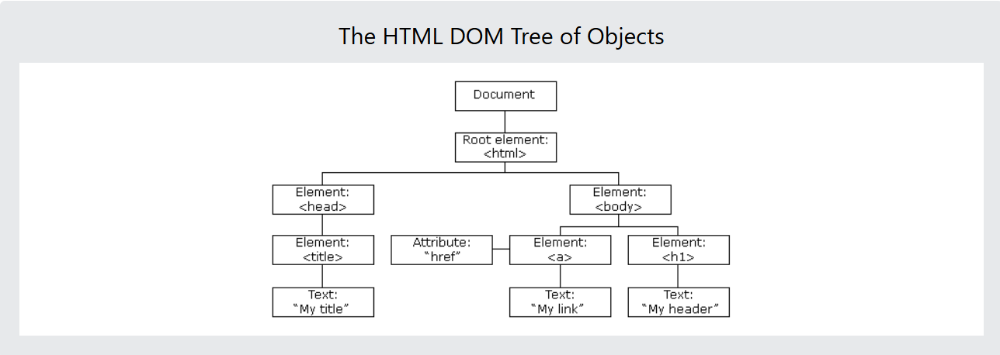

# DOM Manipulation

## What is the HTML DOM

The **HTLM DOM** model is constructed as a tree of **Objects**:
 

- With the object model, Javascript gets all the power it needs to create dynamic HTML:
  - JS can change all the HTML elements in the page.
  - JS can change all the HTML attributes in the page.
  - JS can change all the CSS styles in the page.
  - JS can remove existing HTML elements and attributes.
  - JS can add new HTML element and attributes.
  - JS can react to all existing HTML events in the page.
  - JS can create new HTML event in the page
- What will you learn? 
  - How to change content of HTML elements?
  - How to change the styles(CSS) of HTML elements?
  - How to create to HTML DOM event?
  - How to add and delete HTML elements? 
- The W3C DOM standard is separated into 3 different parts:
  - Core DOM - standard model for all document types.
  - XML DOM - standard model for XML documents.
  - HTML DOM - standard model for HTML documents.
  
## HTML DOME Methods
HTML DOM methods is **actions** you can perform (on HTML element).
HTML DOM properties are **values** (of HTML elements) that you can set or change.

## JS HTML DOM Document
### Finding HTML elements


### Changing HTML elements


### Adding and Deleting elements


### Adding Event Handles


### Finding HTML Objects


## JS HTML DOM Elements
### Finding HTML Elements
- Finding HTML elements by id.
```js
const element = document.getElementById("intro")  // intro is id-name.
```
- Finding HTML elements by tag name.
```js
const element = document.getElementsByTagName("p") // p is tag-name

// First you finds the element with "id = 'main'", and then finds all <p> elements inside "main".
const x = document.getElementById("main") 
const y = x.getElementsByTagName("p")
```
- Finding HTML elements by class name.
```js
const element = document.getElementsByClassName("intro")    // intro is class-name 
```
- Finding HTML elements by CSS selectors.
```js
const x = document.querySelectorAll("p.intro")  // p.intro meaning a list of all "<p>"  elements with 'class="intro"'
```
- Finding HTML elements by HTML object collections.
    - Example: finds the form element with id="fm1", in the forms collection, and displays all element values:
    ```js
    const x = document.forms["frm1"];
    let text = "";
    for (let i = 0; i < x.length; i++) {
      text += x.elements[i].value + "<br>";
    }
    document.getElementById("demo").innerHTML = text;
    ```
    - The following HTML objects (and object collections) are also accessible:
    ```js
    document.anchors
    document.body
    document.documentElement
    document.embeds
    document.forms
    document.head
    document.images
    document.links
    document.scripts
    document.title
    ```
    

## References
[The w3school tutorial for JS](https://www.w3schools.com/js/js_htmldom.asp)