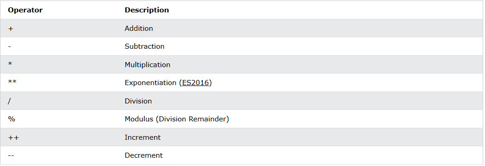
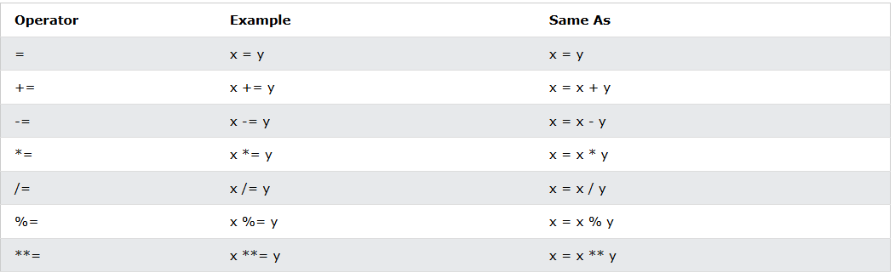
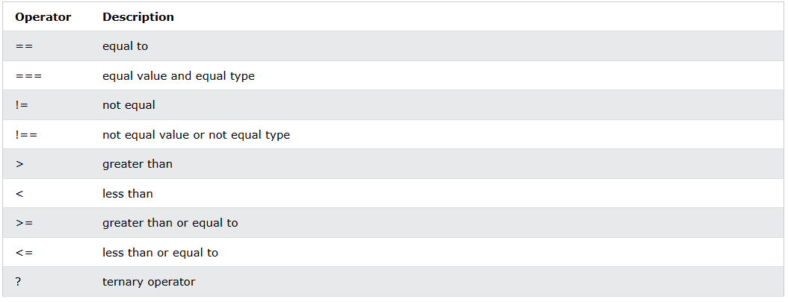
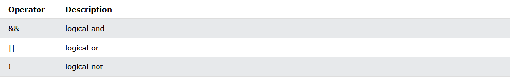
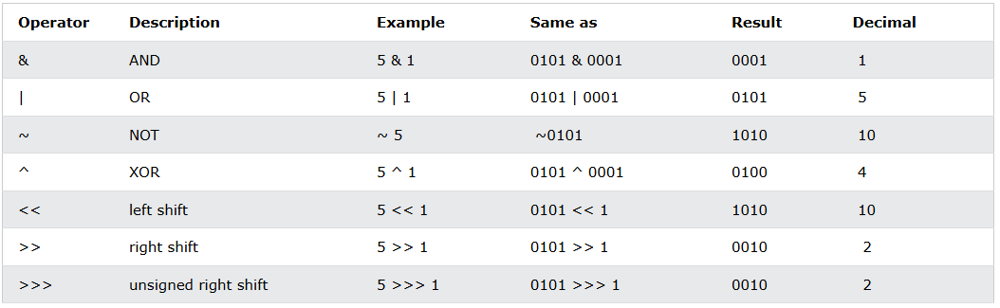
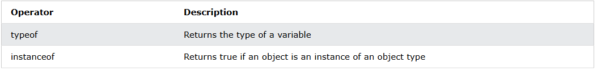

# Javascript

## Why study Javascript? 
For me, It is a progamming language for web development. Anyone who wants to become a web developer starts with it and I am no exception ^_^.

For technique, **JS** to program the behavior of web pages.

## Core Javascript Fundamentals.

### Syntax and Basics.

Variables(**let, const, var**)
- JS variables can be declared in 4 ways:
  - Automaticlly.
  - Using **var**
  - Using **let**
  - Using **const**
- Example:
```js
x = 5 // Automaticlly
var y = 6 // Using var
let z = 7 // Using let
const t = 8 // Using const
```
- When to use **var, const, let**?
    1. Always declare variables.
    2. Always use **const** if they value should not be changed.
    3. Always use **const** if the type should not be changed (Arrays or Objects)
    4. Only use **let** if you can't use **const**.
    5. Only use **var** if you MUST support older browsers.
- The general rules for constructing names for variables(unique identifiers) are:
  - Names can contain letters, digits, underscores, and dollar signs.
  - Names must begin with a letter.
  - Name can also begin with $ and _.
  - Names are case sensitve (y ane Y are different variables).  
  - Reserved words (like JS keywords) cannot be used as usual.

JS Operators
- JS operators are used to perform different types of mathematical and logical computations.
- Examples:
  - The **Assignment Operator** = assigns values.
  - The **Addtion Operator** + adds values.
  - The **Multiplication Operator** * multiplies values.
  - The **Comparison Operator** > compares values.
- Types of JS operators.
  - There are different types of javascript operators:
    - Arithmetic Operators.
    
    - Assignment Operators.
    
    - Comparison Operators.
    
    - String Operators.
    - Logical Operators.
    
    - Bitwise Operators.
    
    - Ternary Operators.
    - Type Operators.
    
  - Adding Strings and Numbers.
    - Adding two numbers, will return the sum as the numbers like 5 + 5 = 10.
    - Adding a number and a string, will return the sum as the concatenated string like 5 + "5" = 55.

JS Control Structures
- JS If Else Swtich.
  - Conditional statements are used to perform different actions based on differents conditions.
  - In JS we have the following conditional statements:
    - Use **if** to specify a block of code to be excuted, if a specified condition is true.
    - Use **else** to specify a block of code to be excuted, if the same condition is false.
    - Use **else if** to specify a new condition to test, if the first condition is false.
    - Use **switch** to specify many alternatives blocks of code to be executed.
  - Example for **if**, **else**:
  ```js
  if (condition) {
    /* code block */
  }
  else if (condition) {
    /* code block */
  }
  else {
    /* code block */
  }
  ```
  - Example for **switch**:
  ```js
  switch (expression) {
    case x:
      // code block
      break;
    case y:
      // code block
      break;
    default:
      //code block
  }
  ```
  - The **break** keyword:
    - When JS reaches a **break** keyword, it breaks out of the code block.

- JS Loop
  - Loops are handy, if you want to run the same code over and over again, each time with a different value.
  - Different kinds of Loops
    - **for** - loops through a block of code a number of times.
    ```js
    for (let i = 0, i < 1000, i++) {
      // code block
    }
    ```
    - **for/in** - loops through the properties of an object.
    ```js
    for (key in object) {
      // code block
    }
    ```
    - **for/of** - loops through the values of an iterable object. 
    ```js
    for (variables in iterable) {
      // code block
    }
    ```
    - **while** - loops through a block of code while a specified condition a true.
    ```js
    while (condition) {
      // code block
    }
    ```
    - **do/while** - also loops through a block of code while a specified condition is true.
    ```js
    do {
      // code block
    }
    while (condition)
    ```


## References
[w3school.com](https://www.w3schools.com/js/js_syntax.asp)

