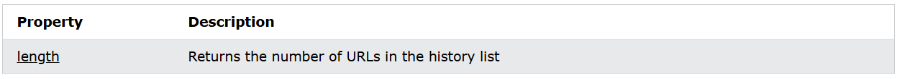

# API (Application Programming Interface)

## Table of contents 
- [API (Application Programming Interface)](#api-application-programming-interface)
  - [Table of contents](#table-of-contents)
  - [JS validation API](#js-validation-api)
  - [JS History API](#js-history-api)
    - [The history back() Method](#the-history-back-method)
    - [The history go() Method](#the-history-go-method)
    - [History Object Properties](#history-object-properties)
    - [History Object Methods](#history-object-methods)
  - [Web Storage API](#web-storage-api)
    - [The LocalStorage Object](#the-localstorage-object)
    - [The sessionStorage Object](#the-sessionstorage-object)
    - [The setItem() Method](#the-setitem-method)
    - [The getItem() Method](#the-getitem-method)
    - [Storage Object Properties and Methods](#storage-object-properties-and-methods)
    - [Related Pages for Web Storage API](#related-pages-for-web-storage-api)
  - [Web Worker API](#web-worker-api)
  - [Fetch API](#fetch-api)
  - [References](#references)


## JS validation API

Constraint Validation DOM Methods.


Constraint Validation DOM Properties.


Validity properties


## JS History API
The web history API provides easy methods to access the **windows.history** object.
The **window.history** object contains the URLs (Web Sites) visited by the user.

### The history back() Method 
The back() method loads the previous URL in the window.history list.
It is the same as clicking the "back arrow" in your browser.
Example:
```html
<button onclick="myFunction()">Go Back</button>

<script>
function myFunction() {
  window.history.back();
}
</script>
```

### The history go() Method
The go() method loads a specific URL from the history list.
Example:
```html
<button onclick="myFunction()">Go Back 2 Pages</button>

<script>
function myFunction() {
  window.history.go(-2);
}
</script>
```

### History Object Properties


### History Object Methods


## Web Storage API
The Web Storage API is a simple syntax for storing and retrieving data in the browser. It is very easy to use 
Example:
```js
localStorage.setItem("name", "John Doe");
localStorage.getItem("name");
```
### The LocalStorage Object 
The local storage object provides access to a local storage for a particular Web site. It allows you to store, read, add, modify, and delete data items for that domain.
The data is stored with no expiration data, and will not be deleted when the browser is closed.
The data will be available for days, weeks, and years.

### The sessionStorage Object
The sessionStorage object is a identical to the localStorage object.
The difference is the sessionStorage object stores data for one session.
The data is deleted when the brower is closed.

### The setItem() Method
The .setItem() method stores a data item in a storage.
It takes a name and a value as parameters:
```js
localStorage.setItem("name", "John Doe");
sessionStorage.setItem(...);
```
### The getItem() Method
The .getItem() method retrieves a data item from the storage.
It takes a name as parameters:
```js
localStorage.getItem("name");
sessionStorage.getItem(...);
```

### Storage Object Properties and Methods


### Related Pages for Web Storage API


## Web Worker API

What is a Web worker?
- When executing scripts in an HTML page, the page becomes unreponsive until the script is finished.
- A web worker is a JS that runs in the background, independently of other scripts, without affecting the performance of the page. You can continue to do whatever you want: clicking, selecting things, etc., while the web worker runs in the background 

## Fetch API
The Fetch API interface allows web browser to make HTTP requests to web servers.
Example:
```js
fetch(file)
.then(x => x.text())
.then(y => myDisplay(y));
```


## References
[w3school](https://www.w3schools.com/js/js_api_intro.asp)